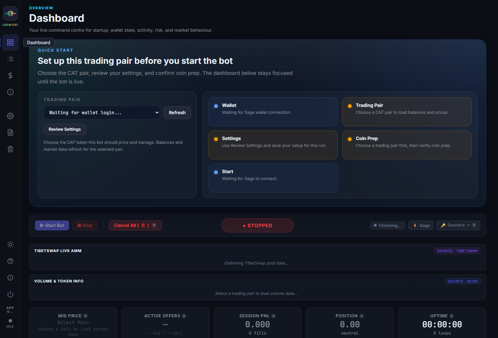

# CATalyst

**Automated liquidity for Dexie, running from your own Chia wallet.**

Providing liquidity on [Dexie](https://dexie.space), Chia's main DEX, means
constantly adjusting offers as the market moves and replacing the ones that
fill. CATalyst handles that work for you. Choose the CAT you want to trade, set
your capital budget, and it maintains a live bid/ask ladder around the market
price, requotes as conditions change, and refills completed offers.

CATalyst runs locally as a desktop application and connects to your
[Sage wallet](https://sagewallet.net/): your keys, your coins, your trades.

**Status:** Beta, actively used in production. No warranty. Use at your own risk.



### [Download the latest release](https://github.com/Lowestofttim/catalyst-bot/releases/latest)

---

## What It Does

Market making means posting both buy and sell offers around the current market
price, then earning the spread as orders fill. Doing this well on Chia is hard:

- Offers are native blockchain assets, not database rows, so every quote move
  costs a transaction.
- Wallet coins must be pre-split into the right denominations before offers can
  be created.
- Fills can appear through Dexie, mempool, wallet, and on-chain signals at
  different times.
- Competitors move the book constantly, and arbitrageurs sweep gaps quickly.

CATalyst handles that operational load. It prepares wallet coins, builds the
ladder, verifies fills, and keeps the book live through reconnects, API outages,
and market shocks.

---

## Features

### Trading

- **Tiered ladder.** Inner, mid, outer, and extreme bands with configurable size
  and count per tier, per side.
- **Dynamic spreads.** Adapts to realised volatility, inventory skew, and
  competitor depth.
- **Smart Settings.** One-click capital planning based on wallet balance and
  market conditions.
- **Sniper probes.** Detects arbitrage gaps between Dexie and TibetSwap AMM and
  fires targeted orders to capture them.
- **Gap-close cascades.** Closes large market moves in staged steps instead of a
  single shock requote.
- **Mempool watch.** Spots TibetSwap swaps before they confirm on chain and
  preempts price moves.

### Execution and Safety

- **Multi-source fill verification.** Spacescan, Sage, and Dexie fallback chain.
  An offer is not recorded as filled until at least one authoritative source
  confirms.
- **Circuit breakers.** Hard price bands, step-change guards, sweep detection,
  and per-cycle cancel/create caps.
- **Dynamic price limits.** Tracks a live reference price and rejects quotes
  outside a configurable band.
- **Risk disclosure.** On first run, the operator must accept an on-screen
  disclosure before the bot can be enabled.

### Coin Management

- **Automatic UTXO splitting.** A background worker keeps the wallet supplied
  with the right size coins for each tier.
- **Proactive drip topup.** Refills each tier at 75% utilisation rather than
  waiting for exhaustion.
- **Orphan reclaim.** Sweeps small change outputs from fills back into
  productive tiers.
- **Budget autoscale.** Performs partial refills when the capital budget is
  tight, instead of stalling the whole ladder.

### Operations

- **Native desktop app.** System tray, notifications, and background operation.
- **Splash P2P.** Broadcasts offers directly to other Splash nodes for
  private-mempool distribution.
- **Self-healing watchdog.** Detects stuck state, stale lifecycle flags, and
  budget drift; repairs them without restarts.
- **Data management.** Separate resets for P&L history, offer history, or full
  state, directly from the GUI.
- **Update checker.** Polls GitHub for new releases.

---

## How It Works

CATalyst runs locally. The UI talks to the local Flask API, the bot loop
coordinates pricing, risk, offers, coins, and fills, and external services are
used for wallet RPC, market data, offer posting, and on-chain verification.

### App flow



### Offer and fill flow



### Coin prep and topup flow



The editable Mermaid source files live in `docs/diagrams/` next to the rendered
SVG and PNG assets.

The trading loop runs on the configurable `LOOP_SECONDS` cadence, defaulting
to 90 seconds:

1. Fetch and blend TibetSwap and Dexie pricing, then update market intelligence.
2. Check risk limits, circuit breakers, inventory skew, and live market depth.
3. Sync live offers from the wallet and detect fills using wallet, Dexie, and
   Spacescan evidence.
4. Cancel, requote, refill, or create offers through Sage wallet RPC.
5. Persist offer state locally, then post/broadcast offer bech32 strings through
   Dexie and Splash.
6. Reconcile coins, top up tier spares, and run runtime health checks.

Between cycles, coin prep/topup reshapes the wallet coin set, AMM monitoring
keeps TibetSwap reserves fresh, and the mempool watcher can wake the loop early
when pending spends suggest a fill or price shock.

---

## Requirements

- Windows 10/11 (64-bit), macOS, or Linux.
- [Sage wallet](https://sagewallet.net/) installed with RPC enabled
  (Settings -> Advanced -> Enable RPC).
- XCH for fees and inventory, plus the CAT token you want to trade.
- Python 3.12 if running from source. Packaged releases have no external Python
  requirement.
- Linux source installs need the WebKit/GTK packages required by PyWebView.
- Windows desktop use requires Microsoft Edge WebView2, which is present on most
  supported Windows 10/11 systems.
- End-to-end browser tests require Playwright's Chromium browser install.

Release packages are published on the
[Releases page](https://github.com/Lowestofttim/catalyst-bot/releases).

## Quick Start

CATalyst is local-first software. Each operator runs their own copy on the same
computer as Sage wallet. GitHub hosts the source code and release downloads; it
does not provide a hosted trading service.

For wallet safety, the browser/API interface is loopback-only by default.
`127.0.0.1` means "this computer", so open the dashboard from the same machine
where CATalyst is running.

### From the Installer (Recommended)

1. Download `Catalyst-Setup-v*.exe` from the
   [latest release](https://github.com/Lowestofttim/catalyst-bot/releases/latest).
2. Run the installer. It places CATalyst in Program Files and adds a desktop
   shortcut.
3. Launch CATalyst on the same computer as Sage wallet. On first run it checks
   the Sage connection, asks you to choose a wallet fingerprint, and guides you
   through Smart Settings.

### From Source on Windows

Use this path if you want the current source code or plan to develop the app.
Run these commands on the same PC as Sage wallet:

```powershell
git clone https://github.com/Lowestofttim/catalyst-bot.git
cd catalyst-bot
py -3 -m venv .venv
.\.venv\Scripts\Activate.ps1
python -m pip install --upgrade pip
python -m pip install -r requirements.txt
python desktop_app.py --flask
```

Then open `http://127.0.0.1:5000/` in a browser on that same PC. To use the
native desktop window instead, run:

```powershell
python desktop_app.py
```

### From Source on macOS or Linux

```bash
git clone https://github.com/Lowestofttim/catalyst-bot.git
cd catalyst-bot
python3 -m venv .venv
source .venv/bin/activate
python -m pip install --upgrade pip
python -m pip install -r requirements.txt
python desktop_app.py --flask
```

Then open `http://127.0.0.1:5000/` in a browser on that same machine.

### First Launch

CATalyst creates a per-user `.env` automatically in the app data directory.
Normal users should not need to copy or edit `.env` by hand.

Startup checks Sage, waits for RPC if needed, and asks you to choose a wallet
fingerprint in the GUI. CAT selection and Smart Settings then save the trading
configuration as you set up the app.

### Changing the Browser Port

If port `5000` is already in use, set `CATALYST_FLASK_PORT` before starting.

Windows PowerShell:

```powershell
$env:CATALYST_FLASK_PORT = "5010"
python desktop_app.py --flask
```

macOS/Linux:

```bash
CATALYST_FLASK_PORT=5010 python desktop_app.py --flask
```

Then open `http://127.0.0.1:5010/` instead.

### Access Denied or Loopback-Only Messages

CATalyst only accepts local browser/API requests by default. If you see an
access warning, check that:

- CATalyst is running on the computer opening the browser.
- You are using `http://127.0.0.1:5000/`, not another PC's IP address, a
  browser-preview URL, or a forwarded port.
- Sage wallet RPC is enabled locally in Sage Settings -> Advanced.
- If Sage certificate auto-detection fails, use the in-app setup prompt or edit
  the local `.env` as a fallback.

Direct API clients also need CATalyst's per-run local write token. The web page
handles this automatically; custom scripts must supply the token themselves.

---

## Known Limitations

- CATalyst is local desktop trading software, not a hosted service.
- The app assumes a trusted local machine, a configured Sage wallet, and network
  access to third-party market data and offer-posting services.
- Trading and market making can lose funds through market movement, bad
  configuration, wallet/API failures, or operator error.
- Splash, Spacescan, Dexie, TibetSwap, and Coinset behavior can change outside
  this repository.
- CATalyst refuses to auto-install a downloaded Splash binary if the release
  does not provide a SHA256 checksum sidecar. Developers can override this with
  `CATALYST_ALLOW_UNVERIFIED_SPLASH_DOWNLOAD=1`, but that should not be used for
  normal release or operator installs.
- The frontend is currently a single large `bot_gui.html` file; public
  maintainability work is tracked separately.

---

## Configuration

CATalyst creates a per-user `.env` on first launch and updates it through the
GUI. Most operators never need to edit it directly:

| Setting | What it does |
|---------|--------------|
| `SAGE_RPC_URL` | Sage wallet RPC endpoint. Default: `https://127.0.0.1:9257`. |
| `SAGE_CERT_PATH` / `SAGE_KEY_PATH` | Optional fallback paths if Sage certificate auto-detection fails. |
| `CAT_ASSET_ID` | The CAT to trade. Written when you pick a token in the GUI. |

Every other trading parameter, including spread, offer count, tier sizes,
reserves, and topup budgets, is configured through **Smart Settings** in the GUI.
Smart Settings reads your wallet balance and current market conditions, then
produces a validated configuration in one click. You can override individual
fields afterwards.

> **Security:** `.env` can contain local wallet paths. Never commit it. The
> `.gitignore` excludes it by default.

---

## Architecture

| Module | Role |
|--------|------|
| `desktop_app.py` | Entry point. Boots Flask, PyWebView window, and system tray. |
| `api_server.py` | HTTP API and Server-Sent Events for the GUI. |
| `bot_loop.py` | Main trading loop orchestrator. |
| `bot_gui.html` | Single-file dashboard UI. |
| `offer_manager.py` | Offer creation, cancellation, and rolling requote. |
| `fill_tracker.py` | Fill detection and multi-source verification. |
| `price_engine.py` | Price oracle using TibetSwap and Dexie. |
| `risk_manager.py` | Circuit breakers, position limits, and spread calculation. |
| `coin_manager.py` | UTXO tracking, tier classification, and topup. |
| `coin_prep_worker.py` | Async coin splitting subprocess. |
| `wallet_sage.py` | Sage wallet RPC adapter. |
| `dexie_manager.py` | Dexie API integration. |
| `spacescan.py` | On-chain verification via Spacescan. |
| `sniper.py` | Arbitrage gap probing. |
| `splash_manager.py` | Splash P2P node integration. |
| `smart_defaults.py` | Capital-aware config generator. |
| `bot_health.py` | Self-healing watchdog. |
| `database.py` | SQLite state layer using WAL mode. |
| `config.py` | Typed `.env` loader with hot reload. |

---

## Tech Stack

- Python 3.12
- Flask HTTP API and Server-Sent Events
- PyWebView desktop shell
- SQLite WAL-mode local database
- Vanilla HTML/CSS/JavaScript frontend
- Sage wallet RPC integration
- Dexie, TibetSwap, Spacescan, Coinset, and Splash integrations
- PyInstaller desktop builds

---

## Project Structure

| Path | Contents |
|------|----------|
| `desktop_app.py` | Main desktop/browser entry point. |
| `bot_gui.html` | Single-file frontend UI. |
| `src/catalyst/` | Python application modules used by the Flask API, bot loop, wallet adapters, and integrations. |
| `src/catalyst/blueprints/` | Flask route groups split by feature area. |
| `tests/` | Unit, integration, and API tests. |
| `tests/e2e/` | Optional Playwright browser tests. |
| `assets/` | App icons and third-party brand assets. |
| `docs/` | Architecture diagrams, release checklist, and internal design notes. |
| `scripts/` | Release, metadata, safety-check, and local diagnostic helpers. |
| `.github/` | Issue templates, Dependabot, and GitHub Actions workflows. |

---

## Running Modes

| Mode | Command | Use case |
|------|---------|----------|
| Desktop | `python desktop_app.py` | Native window and system tray. |
| Browser | `python desktop_app.py --flask` | Server-only mode for `http://127.0.0.1:5000/`. |
| Dev | `python desktop_app.py --dev` | Desktop window and browser access together. |

---

## Data Location

CATalyst stores its SQLite database, logs, and runtime state in the OS standard
app-data directory:

- **Windows:** `%APPDATA%\Catalyst\`
- **macOS:** `~/Library/Application Support/Catalyst/`
- **Linux:** `~/.local/share/Catalyst/`

Override with the `CMM_DATA_DIR` environment variable.

---

## Building from Source

```bash
python -m pip install -r requirements-dev.txt
python build.py              # full clean build, produces dist/Catalyst/
python build.py --no-clean   # skip cleaning for faster iteration
```

The local build output stays on the machine that ran `python build.py`. To share
builds with users, publish a GitHub Release or push a `v*` tag. The release
workflow builds Windows, macOS, and Linux packages, plus a Windows installer, and
uploads them to a new GitHub Release.

---

## Tests

```bash
python -m pip install -r requirements-dev.txt
python -m pytest tests -q --ignore=tests/test_coin_prep.py --ignore=tests/test_coin_prep_v2.py --ignore=tests/test_offer_create.py
python -m ruff check . --select E9,F821
python -m bandit -r src --ini .bandit -ll
python scripts/check_tracked_secrets.py
```

Standalone live-wallet scripts are excluded by `tests/conftest.py` and the explicit ignores above.

---

## Contributing and Security

- Bug reports, feature ideas, and pull requests: see [CONTRIBUTING.md](CONTRIBUTING.md).
- Release history: see [CHANGELOG.md](CHANGELOG.md).
- Security reports: see [SECURITY.md](SECURITY.md). Do not open public issues for suspected vulnerabilities.
- General support: see [SUPPORT.md](SUPPORT.md).
- Community expectations: see [CODE_OF_CONDUCT.md](CODE_OF_CONDUCT.md).
- Third-party asset and trademark notes: see [THIRD_PARTY_NOTICES.md](THIRD_PARTY_NOTICES.md).

---

## Disclaimer

This is beta software that controls a live trading wallet. **There is no
warranty.** You can lose funds if the bot misbehaves or if you misconfigure it.
The authors accept no liability for financial losses. Start with small capital
and monitor the bot while you learn its behaviour.

---

## License

[MIT License](LICENSE). Copyright (c) 2026.
